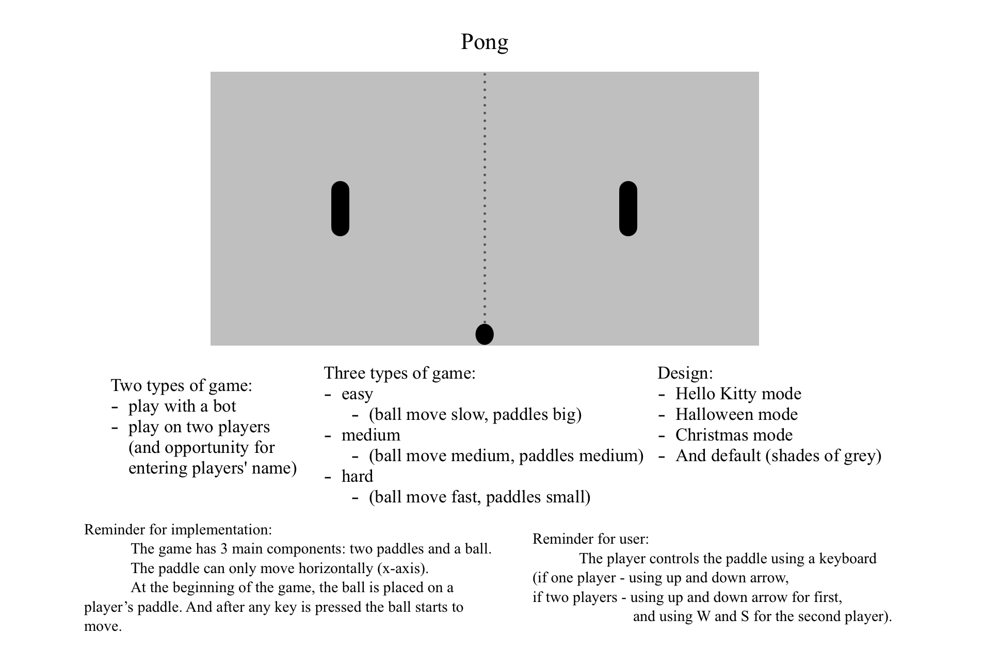
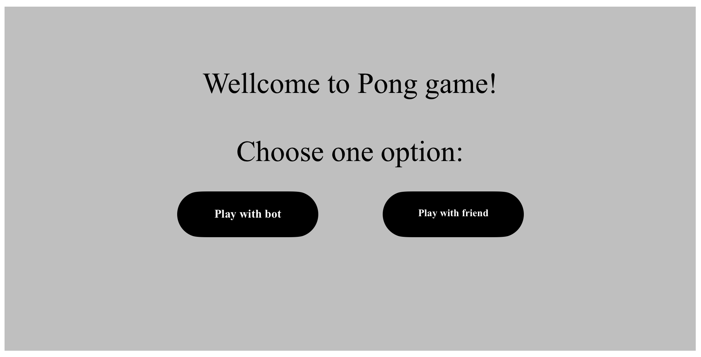
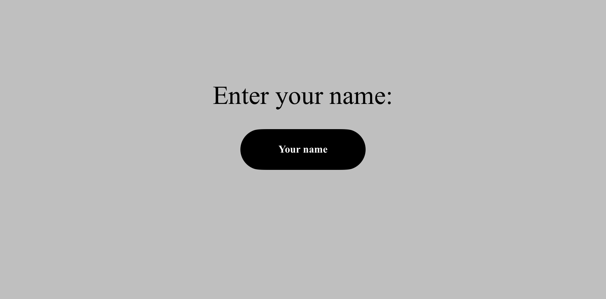
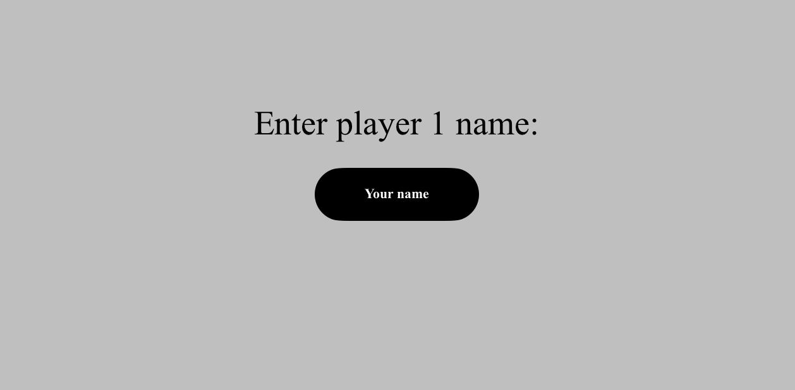
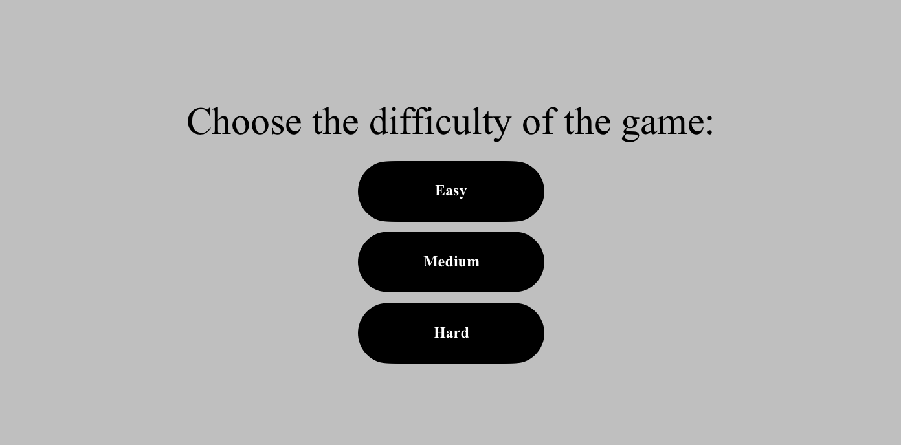
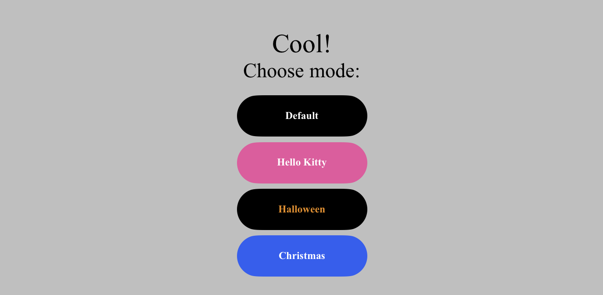
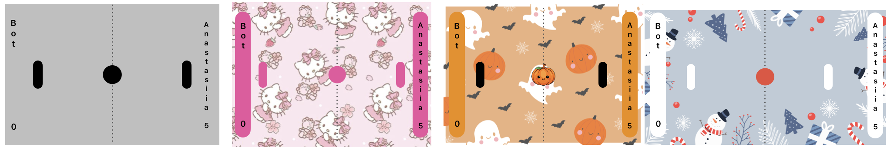

# Pong
## Game Engine Design - UML
1. [System description]([#-The-main-logic/concepts-of-the-future-game:])

### The main logic/concepts of the future game:

    

### Step-by-step explanation - visualization

- First, the user must choose to play with a bot or play with a friend:  
    
- After that, the user can enter the name (for one or two players):  
    If one player - play with a bot:
  

      
  
  
    If two players:  
  

    
    
  

- Then, the user should choose the difficulty of the game, as mentioned before, the choice of the user will depend on the speed of the ball and the size of the paddles:  
    
- And now the user may choose mode:  
      
- Finally, user (or users) can play:  
    
