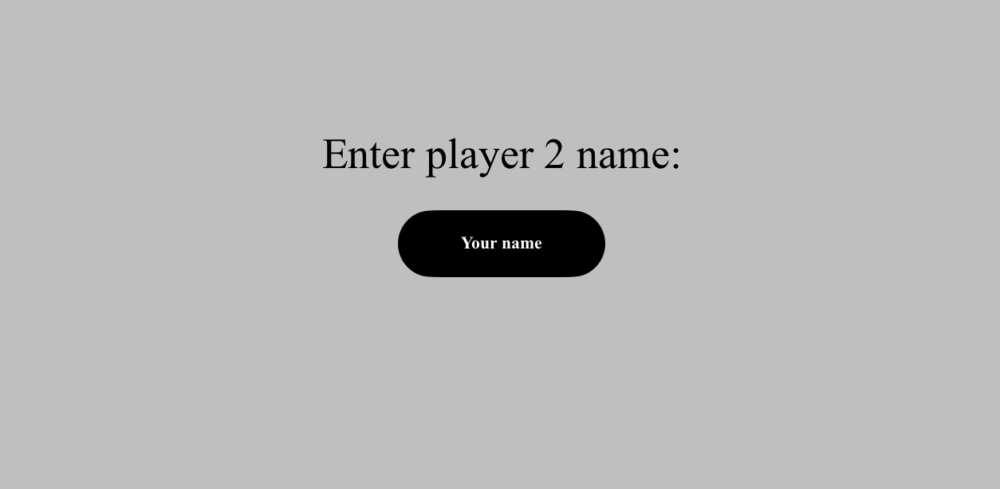

# Pong
## Game Engine Design - UML

### The main logic/concepts of the future game:

    

### Step-by-step explanation - visualization

- First, the user must choose to play with a bot or play with a friend:  
    
- After that, the user can enter the name (for one or two players):  
    If one player - play with bot:
  

      
  
  
    If two players:  
  

    
    
  

